<!-- 
  =========================================================================================
  SAQIB VISUALS | PREMIUM GITHUB PROFILE
  Author: Saqib Manuel (techai342)
  Website: https://mrsaqib.vercel.app
  Version: 3.0.0 (Ultimate Edition)
  =========================================================================================
-->

<!-- HEADER BANNER -->
<div align="center">
  
</div>

<!-- NAVIGATION BADGES -->
<div align="center">
  
  <!-- Socials & Links -->
  <a href="https://mrsaqib.vercel.app">
    
  </a>
  <a href="https://wa.me/923478936242">
    
  </a>
  <a href="https://github.com/techai342">
    
  </a>
  <a href="mailto:mrsaqib242242@gmail.com">
    
  </a>
  
  <br/>
  
  <!-- Status Badges -->
  
  
  

</div>

<br />

<!-- TYPING ANIMATION -->
<div align="center">
  <a href="https://git.io/typing-svg">
    
  </a>
</div>

<br />

---

## 🖥️ `Terminal_Session: user@saqib_visuals`

```bash
$ whoami
> Saqib Manuel (techai342)

$ cat about_me.txt
> I am a multidisciplinary creative developer situated at the intersection 
> of design, code, and motion. I don't just build websites; I engineer 
> digital experiences that leave a lasting impact.

$ grep -r "passion" ./life
> Visual Storytelling
> Clean, Modern UI Architecture
> Cinematography & VFX
> Teaching & Community Building

$ uptime
> Coding since 2018... 
> Uptime: 24/7 (Coffee powered ☕)
```

---

## 🧠 `Identity_Matrix.json`

```json
{
  "user": {
    "name": "Saqib Manuel",
    "alias": "Visual Legend",
    "origin": "Pakistan",
    "traits": ["Creative", "Resilient", "Detail-Oriented", "Visionary"],
    "hobbies": [
      "Coding Late Night",
      "Color Grading",
      "Analyzing UX Trends",
      "Gaming (Free Fire)"
    ]
  },
  "profession": {
    "title": "Frontend Engineer & VFX Artist",
    "level": "Senior",
    "company": "Freelance / Saqib Visuals",
    "years_experience": 6
  },
  "mission": "To bridge the gap between static code and dynamic emotion."
}
```

---

## 🛠️ `Tech_Arsenal.exe`

I utilize a cutting-edge stack to deliver performance, aesthetics, and functionality. My toolkit is divided into four main quadrants.

### **Quadrant 1: Frontend Engineering**
<div align="left">
  
</div>

### **Quadrant 2: Backend & Database**
<div align="left">
  
</div>

### **Quadrant 3: Creative Suite & VFX**
<div align="left">
  
</div>

### **Quadrant 4: DevOps & Tools**
<div align="left">
  
</div>

---

## 📊 `GitHub_Analytics`

A visual representation of my open-source contributions and coding habits.

<div align="center">
  <!-- Stats Card -->
  <a href="https://github.com/techai342">
    
  </a>
  
  <!-- Languages Card -->
  <a href="https://github.com/techai342">
    
  </a>
</div>

<br />

<div align="center">
  <!-- Streak Stats -->
  
</div>

---

## 🏆 `Trophy_Cabinet`

Achievements unlocked throughout my journey on GitHub.

<div align="center">
  <a href="https://github.com/ryo-ma/github-profile-trophy">
    
  </a>
</div>

---

## 🐍 `Contribution_Topography`

<div align="center">
  
</div>

---

## 🚀 `Project_Case_Studies.md`

Detailed breakdown of my most significant deployments.

### 1️⃣ **FF Tournament Platform**
> **Concept:** A high-performance competitive gaming hub for Garena Free Fire.
>
> **The Challenge:** Needed a system to handle real-time registration, bracket generation, and leaderboard updates for thousands of users simultaneously.
>
> **The Solution:** Built with React for a snappy UI and Tailwind for rapid styling. Implemented a custom backend logic for automated matchmaking.
>
> **Tech Stack:**
> - **Frontend:** React.js, Tailwind CSS
> - **State Management:** Context API
> - **Deployment:** Vercel

### 2️⃣ **Saqib AI Studio**
> **Concept:** A futuristic SaaS landing page for AI-generated content tools.
>
> **The Challenge:** To create a "sci-fi" aesthetic that feels professional yet cutting-edge, ensuring high SEO performance.
>
> **The Solution:** Utilized Next.js for server-side rendering and Framer Motion for complex scroll-triggered animations.
>
> **Tech Stack:**
> - **Framework:** Next.js 14
> - **Styling:** CSS Modules + Tailwind
> - **Animation:** Framer Motion

### 3️⃣ **Open Bazaar (E-Commerce)**
> **Concept:** A fully functional decentralized marketplace template.
>
> **The Challenge:** Managing cart state, user authentication, and payment gateway simulation securely.
>
> **The Solution:** A MERN stack application (MongoDB, Express, React, Node) providing a full REST API for product management.
>
> **Tech Stack:**
> - **Database:** MongoDB Atlas
> - **API:** Express.js REST
> - **Auth:** JWT (JSON Web Tokens)

---

## 📂 `Full_Deployment_Log`

| Project Name | Category | Status | Stack | Link |
| :--- | :--- | :--- | :--- | :--- |
| **FF Tournament** | 🎮 Gaming | 🟢 Live | React | [Visit](https://freefire.zone.id/) |
| **Saqib AI Studio** | 🤖 AI Tool | 🟢 Live | Next.js | [Visit](https://saqibaistudio.vercel.app/) |
| **Food One** | 🍔 Delivery | 🟢 Live | Redux | [Visit](https://food-one-jade.vercel.app/#/) |
| **Open Bazaar** | 🛒 E-Commerce | 🟢 Live | MERN | [Visit](https://openbazaar.vercel.app/#/) |
| **Shoes Hub** | 👟 Fashion | 🟢 Live | React | [Visit](https://shoes-91zl.vercel.app/) |
| **Fashion Zone** | 👗 Apparel | 🟢 Live | Next.js | [Visit](https://shoes.zone.id) |
| **Unban Tool** | 🛠️ Utility | 🟡 Beta | JS | [Visit](https://Unban.zone.id) |
| **Tech AI Zone** | 📰 Blog | 🟢 Live | WP/PHP | [Visit](https://techai.zone.id) |
| **Social Hacking** | 🔍 OSINT | 🟢 Live | Python | [Visit](https://follower-woz5.vercel.app/) |

---

## ⚙️ `Hardware_Specs`

I believe in using the best tools to minimize friction between thought and execution.

| Component | Specification |
| :--- | :--- |
| **Primary Machine** | Custom Built PC (Ryzen 9 / RTX 4080) |
| **Portable** | MacBook Pro M2 Max |
| **Display** | Dual 27" 4K IPS Monitors |
| **Keyboard** | Keychron K2 (Brown Switches) |
| **Mouse** | Logitech MX Master 3S |
| **Audio** | Sony WH-1000XM5 |
| **Camera** | Sony Alpha a7 IV (For content creation) |

---

## ⚡ `Services_Manifest.json`

If you are looking to collaborate, here is what I bring to the table.

```json
{
  "Video_Editing": {
    "Level": "Expert / Cinematic",
    "Software": ["Premiere Pro", "After Effects", "DaVinci Resolve"],
    "Offerings": [
      "YouTube Content", 
      "Commercial Ads", 
      "Short Form (Reels/TikTok)", 
      "VFX Compositing"
    ]
  },
  "Web_Development": {
    "Level": "Senior Frontend",
    "Software": ["React", "Next.js", "Vite", "Tailwind"],
    "Offerings": [
      "Portfolio Sites", 
      "E-Commerce Platforms", 
      "Landing Pages", 
      "Web Applications"
    ]
  },
  "Graphic_Design": {
    "Level": "Professional",
    "Software": ["Photoshop", "Illustrator", "Figma"],
    "Offerings": [
      "Brand Identity", 
      "UI/UX Prototyping", 
      "Social Media Kits", 
      "Thumbnail Design"
    ]
  }
}
```

---

## 🔄 `Development_Lifecycle`

My process is iterative and user-focused.

```mermaid
graph TD
    A[🧠 DISCOVERY] -->|Research & Analysis| B(📝 STRATEGY)
    B -->|Wireframing| C{🎨 DESIGN}
    C -->|UI Approval| D[💻 DEVELOPMENT]
    D -->|Frontend & Backend| E[🧪 TESTING]
    E -->|QA & Bug Fixes| F[🚀 DEPLOYMENT]
    F -->|CI/CD Pipeline| G[📈 GROWTH]
    G -->|Analytics & Updates| A
    
    style A fill:#ff005c,stroke:#fff,stroke-width:2px,color:#fff
    style D fill:#00f2ea,stroke:#fff,stroke-width:2px,color:#000
    style G fill:#7a00ff,stroke:#fff,stroke-width:2px,color:#fff
```



---

## 💡 `Philosophy.md`

### **"Simplicity is the ultimate sophistication."**

I believe that code should be as clean as the design it powers. A website is not just a collection of tags and scripts; it is a canvas where functionality meets emotion.

1.  **User First:** Performance and accessibility are not optional features; they are requirements.
2.  **Clean Code:** Maintainable, scalable, and self-documenting codebases are my standard.
3.  **Visual Impact:** A product must look as good as it works. Aesthetics build trust.

> "In a world full of templates, be a custom component."

---

## 🎵 `Coding_Playlist`

What I listen to while deploying to production.

- **Genre:** Lo-Fi / Synthwave / Phonk
- **Top Artists:** Kordhell, DVRST, Lofi Girl
- **Vibe:** Deep Focus & High Energy

<div align="center">
  
  
</div>

---

## 🌐 `Connect_With_Me`

Let's turn your ideas into reality. I am active on all major platforms.

<div align="center">
  <a href="https://instagram.com/mr_saqib242" target="_blank">
    
  </a>
  <a href="https://linkedin.com/in/mrsaqib242" target="_blank">
    
  </a>
  <a href="https://facebook.com/mrsaqib242" target="_blank">
    
  </a>
  <a href="https://twitter.com/mrsaqib242" target="_blank">
    
  </a>
  <a href="https://tiktok.com/@mr_saqib_242" target="_blank">
    
  </a>
  <a href="https://wa.me/923478936242" target="_blank">
    
  </a>
</div>

<br />

<!-- QUOTES CAROUSEL -->
<div align="center">
  
</div>

---

<!-- FOOTER -->
<div align="center">
  
  
  <br/>
  
  <p>Visitor Count</p>
  
  
  <br/><br/>
  
  <p align="center">
    
  </p>
</div>

<!-- 
  =========================================================================================
  SEO & METADATA
  Saqib Visuals, Video Editing, Web Development, React, Vite, Tailwind CSS, 
  Portfolio, Pakistan, Freelancer, Creative Director, TechAI342.
  Full Stack Developer, MERN Stack, Next.js Expert.
  =========================================================================================
-->
