<!-- 
  SAQIB VISUALS - GITHUB PROFILE README 
  Theme: Cyberpunk / Neon / Dark Mode
  Author: Saqib Visuals
-->

<!-- =========================================================================================
     HEADER SECTION - WAVING CAPSULE ANIMATION
     ========================================================================================= -->


<div align="center">

  <!-- PROFILE PICTURE WITH NEON GLOW EFFECT -->
  <a href="https://saqib.zone.id">
    
  </a>

  <br/><br/>

  <!-- DYNAMIC TYPING TEXT SVG -->
  <a href="https://git.io/typing-svg">
    
  </a>

  <br/>

  <!-- SOCIAL BADGES - ROW 1 -->
  <p>
    <a href="https://mrsaqib.vercel.app">
      
    </a>
    <a href="https://wa.me/923478936242">
      
    </a>
    <a href="https://www.instagram.com/mr_saqib242">
      
    </a>
  </p>
  
  <!-- SOCIAL BADGES - ROW 2 -->
  <p>
    <a href="https://www.tiktok.com/@mr_saqib_242">
      
    </a>
    <a href="mailto:mrsaqib242242@gmail.com">
      
    </a>
    <a href="https://github.com/tech242242">
      
    </a>
  </p>

  <br/>
  
  <!-- PROFILE VIEWS COUNTER -->
  

</div>

<br/>

<!-- =========================================================================================
     ABOUT ME - TERMINAL STYLE
     ========================================================================================= -->

## 👨‍💻 `whoami`

```bash
user@saqib-visuals:~$ cat about_me.txt

> Name:      Saqib Manuel
> Role:      Creative Director & Full Stack Visual Artist
> Location:  Digital Universe (Based in Pakistan)
> Mission:   To bridge the gap between imagination and reality through code and pixels.
> Style:     Cyberpunk / Neon / Minimalist / High-Energy
> Status:    AVAILABLE FOR HIRE (Freelance & Contract)

user@saqib-visuals:~$ npm start portfolio
> Initializing creative engine...
> Loading assets... 100%
> Ready to create magic.
```

---

<!-- ANIMATED DIVIDER LINE -->
<div align="center">
  
</div>

<!-- =========================================================================================
     SKILLS & TECH STACK
     ========================================================================================= -->

## 🚀 The Creative Arsenal

I don't just use tools; I master them to create visual symphonies.

### 🎨 Design & Editing (The Visual Core)
<div align="center">
  <a href="https://skillicons.dev">
    
  </a>
</div>

### 💻 Development (The Code Logic)
<div align="center">
  <a href="https://skillicons.dev">
    
  </a>
</div>

### 🛠️ Infrastructure & Tools
<div align="center">
  <a href="https://skillicons.dev">
    
  </a>
</div>

---

<!-- =========================================================================================
     GITHUB STATS & ANALYTICS
     ========================================================================================= -->

## 📊 The Data Center

<div align="center">
  
  <!-- GITHUB STATS CARD -->
  <a href="https://github.com/tech242242">
    
  </a>
  
  <!-- TOP LANGUAGES CARD -->
  <a href="https://github.com/tech242242">
    
  </a>

</div>

<br/>

<div align="center">
  <!-- STREAK STATS -->
  
</div>

---

<!-- =========================================================================================
     TROPHIES
     ========================================================================================= -->

## 🏆 Trophy Case

<div align="center">
  <a href="https://github.com/ryo-ma/github-profile-trophy">
    
  </a>
</div>

---

<!-- =========================================================================================
     CONTRIBUTION GRAPH (SNAKE ANIMATION)
     ========================================================================================= -->

## 🐍 Code Contribution Cycle

<div align="center">
  
</div>

---

<!-- =========================================================================================
     SERVICES TABLE
     ========================================================================================= -->

## ⚡ Services Offered

| Service | Description | Tech/Tools |
| :--- | :--- | :--- |
| **🎬 Video Editing** | High-end commercial, music video, and social media editing. | Premiere Pro, After Effects |
| **💻 Web Development** | Custom React.js websites with crazy animations (GSAP/Framer). | React, Tailwind, Vite |
| **🎨 UI/UX Design** | Modern, sleek interfaces for mobile and web apps. | Figma, Adobe XD |
| **📸 Photo Manipulation** | Surreal digital art and high-end retouching. | Photoshop, Lightroom |
| **📱 Social Content** | Viral-optimized content creation for TikTok/Reels. | CapCut, Snapseed |

---

<!-- =========================================================================================
     WORKFLOW
     ========================================================================================= -->

## 🔄 The Workflow

```mermaid
graph TD;
    A[💡 Concept] --> B{Strategy};
    B -->|Design| C[🎨 UI/Visuals];
    B -->|Code| D[💻 Development];
    C --> E[✨ Polish];
    D --> E;
    E --> F[🚀 Launch];
```



---

<!-- =========================================================================================
     PHILOSOPHY QUOTES
     ========================================================================================= -->

## 💭 Philosophy

<div align="center">
  
</div>

---

<!-- =========================================================================================
     FOOTER SECTION
     ========================================================================================= -->

<div align="center">
  
  
  <h3>
    <a href="https://mrsaqib.vercel.app">VISIT OFFICIAL PORTFOLIO</a>
  </h3>
  
  <p>© 2026 Saqib Visuals. All Rights Reserved.</p>
  
  <!-- Small hidden credits to improve SEO/Search in repo -->
  <details>
    <summary>Hidden Keywords</summary>
    Video Editor, React Developer, Frontend Engineer, Graphic Designer, Portfolio, Creative Director, Pakistan, Freelancer.
  </details>
</div>
